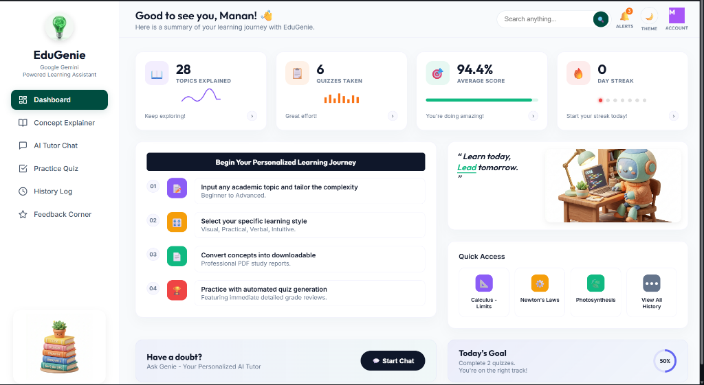
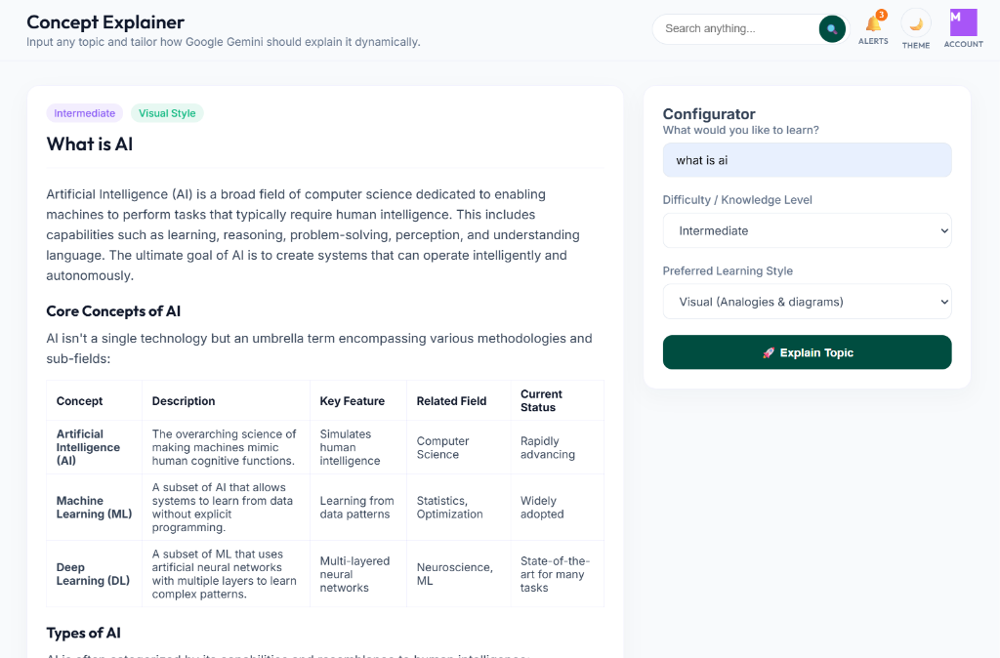
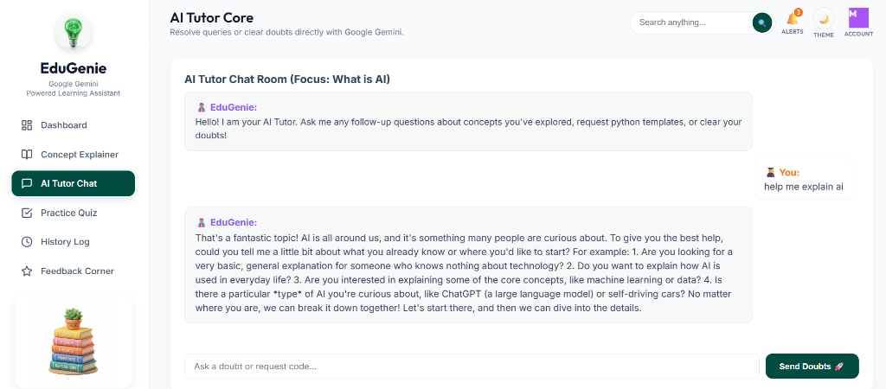
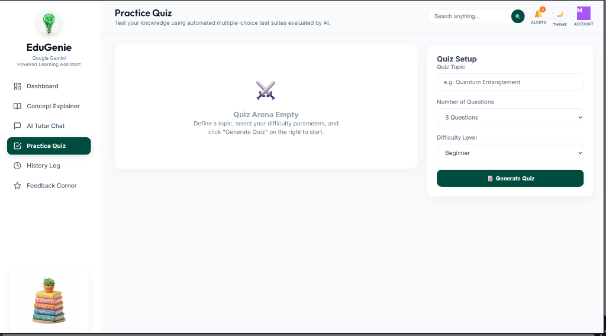
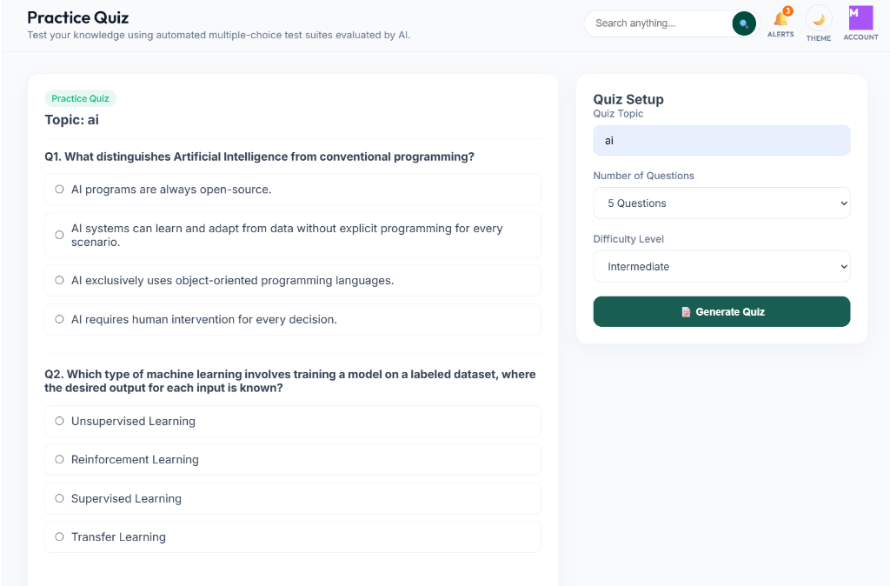
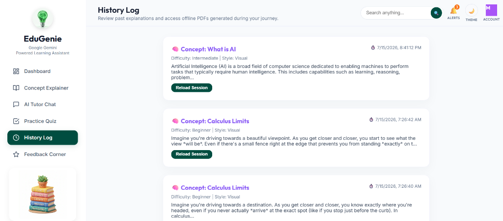
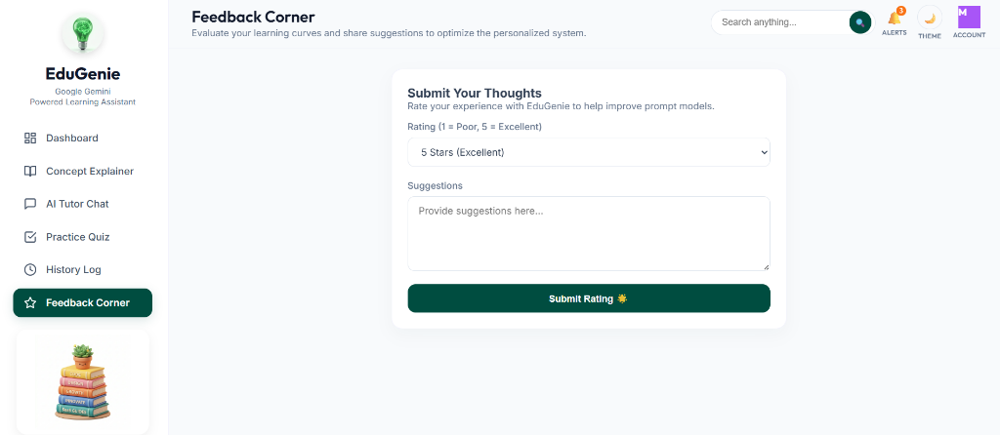

# EduGenie - Google Gemini Powered Learning Assistant

## 🔗 Project Links
- **GitHub Repository**: [manankochar1720 / Gen-ai-Google-Gemini-Powered-Learning-Assistant](https://github.com/manankochar1720/Gen-ai-Google-Gemini-Powered-Learning-Assistant)
- **Demo Video Walkthrough**: [Google Drive Link](https://drive.google.com/file/d/1bKsPvajDTE8vF-AaRfxUXIssAQp171tJ/view?usp=sharing)

## 🚀 Project Overview
**EduGenie** is a state-of-the-art AI-powered personalized learning assistant designed to address the limitations of one-size-fits-all academic education. Traditional learning methodologies often fail to cater to the diverse learning speeds, comprehension levels, and cognitive preferences of individual students. This mismatch in teaching styles can lead to reduced engagement, incomplete topic mastery, and academic stress.

EduGenie bridges this gap by acting as an adaptive learning companion. The application leverages the **Google Gemini API** (`gemini-2.5-flash`) to dynamically tailor any academic topic, difficulty level (Beginner, Intermediate, Advanced), and learning style (Visual, Practical, Verbal, Intuitive) into customized study guides and analogical matrices. It also provides an interactive AI Tutor Chat Room for continuous doubt-clearing, dynamic Practice Quizzes with automated grading, and offline study report compilation using ReportLab PDF generation.

---

## ✨ Features
- **Adaptive Topic Explainer**: Formulates structured explanations matching specific styles (e.g., *Visual* with analogical cards and summary tables, *Practical* with step-by-step code blocks).
- **Interactive AI Tutor Chat Room**: Live, context-aware doubt-clearing room to resolve academic questions dynamically.
- **Automated Practice Quizzes**: Generates randomized multiple-choice tests with immediate grading and detailed answer feedback.
- **Offline Study Reports**: Compiles custom lesson guides and quiz results into beautiful, print-ready PDF reports.
- **Persistent Logs**: Saves learning progress, quiz attempts, and user feedback into local JSON storage.
- **Polished Glassmorphism UI**: Premium dashboard with glowing elements, transitions, and dark-shade theme toggling.

---

## 🛠️ Tech Stack
- **Backend**: FastAPI, Uvicorn, Pydantic
- **Frontend**: Streamlit, HTML5, Vanilla JavaScript, CSS3
- **GenAI Inference Engine**: Google Gemini API (`gemini-2.5-flash`)
- **PDF Generation**: ReportLab
- **Testing**: Pytest, FastAPI TestClient

---

## 🏗️ Project Architecture
```text
        User
         ↓
  Streamlit Frontend (index.html)
         ↓
    FastAPI Backend
         ↓
    API Router
         ↓
    ┌────┼──────────────┬──────────────┬──────────────┐
    ↓    ↓              ↓              ↓              ↓
  Topic  Tutor        Quiz           History        Feedback
  Explainer Chat      Generator      Logger         Logger
    └────┼──────────────┼──────────────┼──────────────┘
         ↓              ↓              ↓              ↓
         └──────────────┴──────┬───────┴──────────────┘
                               ↓
                        JSON Data Store & Gemini API
```

### Component Descriptions:
- **User**: Requests topics, selects learning style/difficulty, chats with tutor, takes quizzes, and downloads reports.
- **Streamlit Frontend**: Serves our modern full-screen HTML interface with fluid transitions, onboarding widgets, and theme toggling.
- **FastAPI Backend**: Hosts the endpoints (`/explain`, `/chat`, `/quiz/generate`, `/quiz/evaluate`, `/pdf/explanation`, `/pdf/quiz`, etc.).
- **API Router**: Directs traffic to corresponding service modules.
- **Gemini Service**: Orchestrates prompt construction and calls Google Gemini API.
- **PDF Generator**: Compiles study guides using ReportLab.

---

## 📸 Application Screenshots

### 1. Main Dashboard
Provides an overview of the student's learning journey, including topics explained, quizzes taken, average score, and a personalized checklist guide.


### 2. Concept Explainer
Generates highly customized learning materials using selected difficulty levels and preferred study styles.


### 3. AI Tutor Chat Room
Allows students to resolve their doubts and ask follow-up questions directly to the Google Gemini AI tutor.


### 4. Practice Quiz Arena
Dynamically creates multiple-choice question sets matching the user's requested topic and difficulty.



### 5. History Log & Offline PDFs
Maintains a log of past learning sessions, allowing the user to reload summaries or download offline PDF study guides.


### 6. Feedback Corner
Allows users to evaluate their learning curve and submit ratings and suggestions to improve the personalized system.

